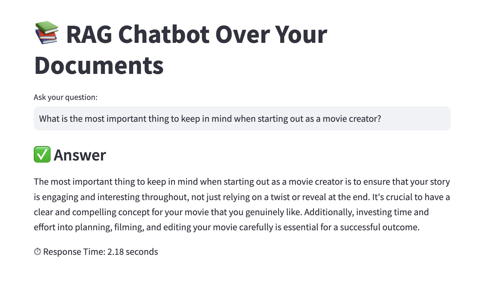

# RAG Chatbot with LangChain, FAISS, OpenAI, and Streamlit

This project is a **Retrieval-Augmented Generation (RAG)** chatbot that allows you to chat with your documents. It uses LangChain, FAISS for vector indexing, OpenAI embeddings and language model, and Streamlit for the user interface. I built this using ChatGPT as a coding assistant.

---

## Architecture Overview

This project uses a RAG (Retrieval-Augmented Generation) architecture with the following flows:

### Retrieval Flow (Query-time)


### Vectorstore Generation Flow (Index-time)


- Documents from the `data/` folder are embedded using OpenAI Embeddings.
- The resulting vectors are stored in a local FAISS vectorstore.
- The retriever fetches relevant chunks from FAISS given a user query.
- The final response is generated using OpenAI LLM via LangChain.
- Streamlit provides the interactive frontend.

---

## 📂 Sample Output

The chatbot works on PDF files placed in the `data/` folder. Here's what the interface looks like:



---

## ☁️ GCP VM Setup (Ubuntu 22.04)

1. **Create a new VM instance** with the following configuration:
   - **Machine type**: e2-standard-2
   - **Boot disk**: Ubuntu 22.04 LTS
   - **Allow HTTP/HTTPS traffic**
   - **Firewall Rule**:
     - Go to VPC Network → Firewall → Create Firewall Rule
     - Name: `allow-streamlit`
     - Targets: All instances in the network
     - Source IP ranges: `0.0.0.0/0`
     - Protocols and ports: check TCP and add `8501`
     - Save

2. SSH into the instance:
```bash
gcloud compute ssh <INSTANCE_NAME> --zone=<ZONE>
```

---

## ⬇️ Setup Instructions

### Step 1: Clone the Repository

```bash
git clone https://github.com/nikhil-tibrewal/rag_chatbot.git
cd rag_chatbot
```

### Step 2: Create Python Virtual Environment

```bash
python3 -m venv venv
source venv/bin/activate
```

### Step 3: Install Dependencies

```bash
pip install --upgrade pip
pip install -r requirements.txt
```

### Step 4: Add Your OpenAI Key

Create a `.env` file in the root directory:

```bash
touch .env
```

Inside `.env`, add:

```bash
OPENAI_API_KEY=your-openai-api-key
```

---

## 🧠 Index Your Data

Place your `.pdf` files into the `data/` directory.

To build or rebuild the index:

```bash
python build_index.py
```

This loads and splits the PDFs, embeds the chunks, and stores the vectors in a FAISS index. Note: due to the size of the PDF files, this can take some time.

---

## 🖥️ Run the Chatbot with Streamlit

We recommend running this inside a `tmux` session so it continues running after you close your terminal.

### Step 1: Start a tmux session

```bash
tmux new -s ragchat
```

### Step 2: Run Streamlit

```bash
streamlit run app.py --server.port 8501 --server.headless true --server.enableCORS false
```

Now open your browser at `http://<EXTERNAL_IP>:8501`

### Step 3: Detach tmux

```bash
Ctrl + b, then press d
```

### Step 4: Resume tmux session later

```bash
tmux attach -t ragchat
```

---

## 📎 Notes

- To add new documents, just place them in the `data/` folder and rerun `python build_index.py`.
- FAISS vectorstore is stored in `faiss_index/` directory.

---

## ✅ Status

Everything is working as expected.
